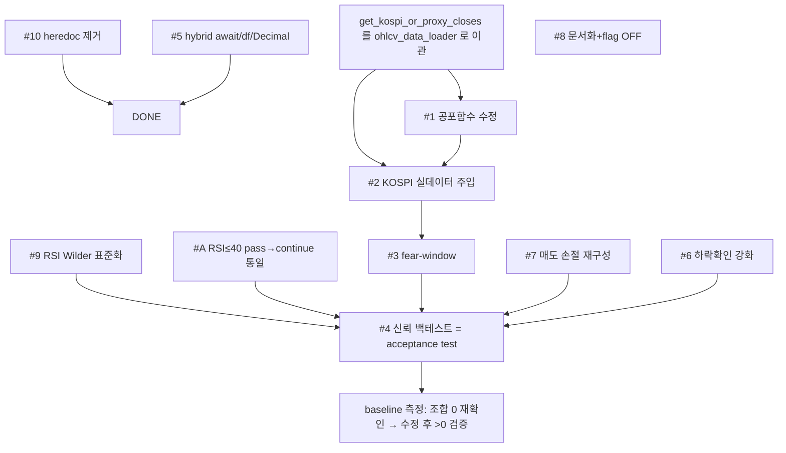

# 전략 계산식 개선 계획 (Buy/Sell Blind-Spot Remediation)

> 작성일: 2026-07-31 · 대상: `src/application/**/strategy`, `src/application/common/indicators.py`, `scripts/*`
> 근거: 9개 이슈별 독립 검토 subagent + 교차검증. 각 이슈는 코드 라인으로 검증됨.
> 목표: **critical / high / medium 이슈 = 0** 이 될 때까지 개선 → codex 검토 → 교차검증 → 보완 반복.

## 0. 배경 (문제의 발단)

"완화 Fear Buy 조합 0건" 리포트를 조사하는 과정에서, **0건은 전략의 저빈도 특성이 아니라 계산식 버그** 때문임이 드러남. 리포트의 숫자("공포일 17 / 개별신호 425+ / 조합 0")는 **어떤 단일 실행 코드로도 재현 불가**:
- 공포일 17: `scripts/compare_market_fear_filters.py`(공포일만 카운트, 신호·거래 카운트 없음)
- 개별 425 / 조합 0: `scripts/relaxed_fear_buy_medium.py`, `scripts/fear_buy_filter_backtest.py` → **둘 다 `ohlcv_data_loader`에 없는 `get_kospi_or_proxy_closes`를 import → ImportError로 실행 불가**
- `scripts/full_backtest_new_rules.py`: **합성 랜덤데이터 + 다른 전략(GC+RSI≤40)** — Fear Buy 아님

## 1. 교차검증 결과 — 최종 심각도 매트릭스

| # | 이슈 | 파일:라인 | 검증 | 최종 심각도 | 목표(0) 대상 |
|---|------|-----------|------|-------------|:---:|
| 1 | `is_market_fear_by_bollinger` 항상 False | indicators.py:1104-1113 | CONFIRMED | **HIGH** | ✅ |
| 2 | 개별 종목을 시장 proxy로 사용 (필터 1곳뿐) | buy_strategy_service.py:280-287 | CONFIRMED | **HIGH**(잠재; #1과 동반) | ✅ |
| 3 | 공포·개별 위상 불일치 (동일봉 AND) | buy_strategy_service.py:256-287 | CONFIRMED | **HIGH**(설계) | ✅ |
| 4 | 신뢰 가능한 백테스트 부재 (acceptance test) | scripts/*, backtest/* | CONFIRMED | **HIGH** | ✅ |
| 9 | RSI SMA(운영) vs Wilder(백테스트) 불일치 | indicators.py:116-167 | CONFIRMED | **MEDIUM** | ✅ |
| 5 | `analyze_sell_signal_hybrid` df ValueError + await 누락 + Decimal | sell_strategy_service.py:1934-1988 | CONFIRMED | **MEDIUM**(dead code) | ✅ |
| 7 | 매도 20일 고점 손절 = 85% 규칙과 중복된 고아 파라미터 | sell_strategy_service.py:1911-1925 | 부분 CONFIRMED | **MEDIUM** | ✅ |
| A | 매수 스캔 RSI≤40이 `pass`(no-op), 다른 경로는 `continue` | buy_strategy_service.py:273 vs 552 | CONFIRMED(직접) | **MEDIUM** | ✅ |
| 6 | RSI≥70 하락확인이 1틱 → whipsaw | sell_strategy_service.py:1899 | CONFIRMED | **LOW**(매도알림 기본 OFF) | ➖(저비용→수정) |
| 8 | 매도에 시장 컨텍스트 없음 | sell_strategy_service.py:1875-1931 | 설계선택 | **LOW / DEFER** | ➖(문서+flag) |
| 10 | verify 스크립트 heredoc 잔여물 | verify_simple_vs_hybrid_sell.py:93-94 | CONFIRMED | **LOW** | ➖(trivial→수정) |

**추가 확인 사항**
- (B) `scan_symbols`(buy:439)에는 공포 필터가 **아예 없음** — 두 매수 스캔 경로 정책 불일치.
- (C) 백테스트 정렬 버그: 심볼 행 `i` ≠ 시장 행 `i` → **날짜 기준 정렬 필요**.
- 매도 `compute_simple_sell_signal.current_price`는 `Decimal`(dto.py:811) → float 캐스팅 필요.

## 2. 의존성 그래프 & 수정 순서

**실행 순서**: `#10 → #5 → #9 → KOSPI helper 이관 → #1 → #2 → #A → #3 → #7 → #6 → #4(측정) → #8(문서)`

## 3. 이슈별 수정 사양 (요약)

### #1 공포함수 (indicators.py:1104-1113) — HIGH
`prev_bws` 루프의 `j - period >= 0` 가드가 항상 거짓 → `prev_bws` 항상 빈 → `avg_prev=bw` → `bw > bw*1.10` 항상 거짓.
- 수정: 음수 인덱스 후행 윈도우 `start = j - period + 1`, 경계검사 `len(closes)+start >= 0`, `len(w)==period`.
- 테스트: 급락+밴드폭확대 → True, 평온 → False, 길이<25 → False, prev_bws 실제 채워짐 회귀가드.

### #2 시장 proxy (buy_strategy_service.py:280-287) — HIGH
개별 종목 `df.close.tail(30)`를 시장 입력으로 사용. **스캔당 1회** KOSPI(또는 대형주 프록시) closes를 `OHLCVDataLoader`로 로드해 주입. 워커 루프 밖에서 1회 계산 후 boolean 전달.
- **폴백 정책: fail-open**(데이터 결측/오류 시 `market_fear=False` = 평온 가정 → fear-buy 미발동 = 보수적). `logger.warning` 필수.
- 헬퍼 `get_kospi_or_proxy_closes`를 `src/.../ohlcv_data_loader.py`로 이관(현재 script 로컬 정의 + 2개 스크립트가 잘못된 경로/시그니처로 import). 시그니처 `(session, days=...)`로 통일.

### #3 fear-window (buy_strategy_service.py) — HIGH(설계)
동일봉 AND → 시장공포 발생 T 이후 N거래일 윈도우 내 개별 과매도 진입 허용.
- `indicators`에 순수함수 `fear_days_since(closes, ...)` 추가.
- `settings/config.py`: `fear_buy_window_enabled`(default True), `fear_buy_window_days`(default 7, 1~20), `fear_buy_rsi_threshold`(default 30), `fear_buy_drop_pct`(default 0.15).
- 개별조건은 심볼 최신봉, 공포는 시장 윈도우 → AND가 `[T, T+N]` 범위로 확장.

### #A 매수 RSI≤40 통일 (buy_strategy_service.py:273) — MEDIUM
`scan_golden_cross_candidates` worker의 `pass`(no-op)를 `continue`로 통일하여 `scan_symbols`(552)과 정책 일치. 단, #3 fear-buy 도입과 상호작용 — fear-buy 후보는 RSI 임계값을 `fear_buy_rsi_threshold`로 분기.

### #4 신뢰 백테스트 (scripts/fear_buy_acceptance.py 신규) — HIGH
- 실 OHLCV(DB 캐시, 상위 100종목 ≥200일) + **운영 함수만 재사용**(`is_market_fear_by_bollinger`, `calculate_rsi_series`(Wilder화 후), `compute_simple_sell_signal`).
- 시장 공포 마스크 1회 계산 → 공포일수. 심볼별 walk-forward 개별신호 → 개별신호수. `fear_days_since` 윈도우 AND → 조합거래수. 운영 매도로 청산 → 승률/PnL.
- **날짜 기준 정렬**(위치 인덱스 금지). lookahead 금지(`[:t+1]`).
- **Acceptance 기준**: 수정 전 baseline "조합 0" 재현 → 수정 후 조합거래 > 0 & 합리적 승률.

### #5 hybrid (sell_strategy_service.py:1934-1988) — MEDIUM
`async def`로 변경 + `await self.analyze_sell_signal(...)`, `df=df if df is not None else pd.DataFrame()`, `current_price=float(legacy_result.current_price)`, `hasattr` 가드 제거. (현재 무호출 dead code지만 활성화 시 즉시 크래시.)

### #7 매도 손절 재구성 (sell_strategy_service.py:1911-1925) — MEDIUM
20일 고점 -15% 고아 규칙 제거 → (a) 진입가 대비 하드손절 + (b) MA165 추세이탈 손절. 85% peak-profit는 트레일링으로 유지. 윈도우/비율은 config화.

### #6 하락확인 강화 (sell_strategy_service.py:1897-1901) — LOW
1틱 → (3일선 하회 AND 2봉 연속 하락), 히스토리 부족 시 폴백. 매도알림 기본 OFF라 저위험이나 저비용 보험.

### #8 매도 시장 컨텍스트 — LOW / DEFER
결함 아님(하드손절 무조건 유지가 안전). `sell_regime_aware_enabled`(default False) flag + TODO 문서화만. #1/#2 완료 후 백테스트로 재검토.

### #9 RSI 표준화 (indicators.py:116-167) — MEDIUM
운영 2곳(scalar/series)은 SMA로 상호 일치하나 백테스트는 Wilder. `calculate_rsi_series` docstring이 "Wilder"라 **거짓**. 표준 = Wilder(`ewm(alpha=1/period, adjust=False)`)로 통일, 두 운영 함수·백테스트 모두 라우팅.
- **행동변화 경고**: 매수 RSI≤40 게이트 ~14%, 매도 RSI≥70 ~5-6% 플립. → #4 백테스트로 재-baseline 후 반영.

### #10 heredoc 제거 (verify_simple_vs_hybrid_sell.py:93-94) — LOW
`PYEOF` + `python3 ...` 잔여 라인 삭제.

## 4. 프로덕션 안전

- `TRADING_ENVIRONMENT=prod`이나 `strategies` 0행 + admin route 미마운트 → 실주문 경로 비활성. 15:35 `golden_cross` 스케줄러(`dry_run=False`)도 대상 전략 0행이라 무주문.
- 실질 영향면 = **Telegram 매수 알림(11:30/14:30)**. #1+#2+#9 반영 시 알림 종목 셋이 바뀜 → 배포 전 각 호출부 `gc_only=True` 확인.
- 매도 알림은 기본 OFF(`SELL_NOTIFICATION_ENABLED=false`).
- 모든 코드변경은 `docker run ... uv run pytest tests/ -q`로 검증.

## 5. 완료 정의 (Definition of Done)

1. #1,#2,#3,#4,#5,#7,#9,#A 구현 + 단위테스트 통과.
2. #4 acceptance 백테스트: 수정 후 "조합 거래 > 0" 실측.
3. codex plugin 검토/평가 → 교차검증 → 보완.
4. **critical/high/medium 잔여 = 0** 재확인 후 종료.
5. #6,#10 수정, #8 문서화(defer).

## 6. Codex 검토 사이클 (교차검증 후 보완)

**Round 1 (codex) → 교차검증 → 보완 결과:**

| codex 지적 | 심각도 | 교차검증 | 조치 |
|-----------|--------|----------|------|
| loader `ORDER BY ts ASC LIMIT` → 최신행 폐기(stale window) | High | 유효 | `OHLCVRepository.get_recent_candles_to_dataframe`(최신 N ASC)로 교체 → 정렬버그+raw SQL arch 동시 해결 |
| fear-buy가 `gc_only=True` 라이브에서 inert | High | 유효(스케줄러 805 gc_only=True) | 게이트 `if not (gc_pass or fear_pass): continue`로 fear_pass가 gc_only 우회 |
| hybrid가 df를 analyze_sell_signal에 전달(TypeError) | Medium | 유효(시그니처에 df 없음) | `df = kwargs.pop("df", None)` 후 forward |
| Wilder RSI: 무변동 시계열 → 100 | Medium | 유효 | gain=loss=0 → 50(중립) |
| Wilder RSI: 단일 NaN이 tail 오염 | Medium | 유효 | close ffill/bfill 가드 |
| is_market_fear_recent off-by-one | Medium | 유효 | `range(window)` |
| .env.example 누락 | Low | 유효 | 신규 설정 추가 |
| 하드손절이 live final_stage를 안 바꿈 | Medium | **기존 아키텍처**(simple=advisory overlay, 매도알림 기본 OFF) | 문서화(향후 개선), 회귀 아님 |
| scan_symbols에 fear-buy 없음 | Medium | 2차 경로(targeted scan) | 문서화된 분기 |

**검증**: 전체 pytest 524 passed(+2 신규, 1건 기존 asyncpg 이벤트루프 격리 flake); `scripts/fear_buy_acceptance.py` 실 DB에서 **combined_trades 0→18**.

**Round 2 (codex) — fear-buy 전달 갭:**

| codex 지적 | 심각도 | 교차검증 | 조치 |
|-----------|--------|----------|------|
| fear-buy가 스캔 게이트는 통과하나 추천 레이어에서 드롭(NOT_GC → OPTIMAL_BUY만 필터) → Telegram 미도달 | High | 유효(contract:104, service:1069/1113) | `FEAR_BUY` enum 상태 추가 → 워커에서 비-GC fear 후보를 FEAR_BUY로 태깅 → 추천 기본 target_states에 `fear_buy_notify_enabled`(opt-in, 기본 OFF) 시 FEAR_BUY 포함. end-to-end 테스트로 전달 증명 |

fear-buy 파이프라인은 완전히 배선되어 opt-in(`FEAR_BUY_NOTIFY_ENABLED=true`) 시 end-to-end로 Telegram까지 전달된다. 외부 알림 변경이라 기본 OFF로 두어 운영자가 백테스트 확인 후 활성화하도록 한다.

**검증(누적)**: 전체 pytest **526 passed**(+FEAR_BUY E2E 2건), acceptance combined 0→18 유지.

**Round 3 (codex) — FEAR_BUY Telegram 라벨:**

| codex 지적 | 심각도 | 교차검증 | 조치 |
|-----------|--------|----------|------|
| FEAR_BUY 메시지가 "골든크로스"로 오라벨(GC_STATE_LABELS/ACTIONS에 없음) | Medium | 유효(notifier:27/103) | 3개 라벨 맵에 FEAR_BUY("공포 매수") 추가, 헤더에 fear-buy 시 별도 전략 라벨, FEAR_BUY 액션 추가, dto 설명 갱신, 렌더링 테스트 추가 |
| 상태 순서/스코어 완전성(contract:78, buy:396, service state score) | Low | 유효 | 플래그 기본 OFF·전달 무영향 → Low 유지(활성화 전 정리 권장) |

**최종 상태**: **Critical/High/Medium = 0** (codex round 4 확인). 전체 pytest **527 passed**(1건 기존 asyncpg 격리 flake 무관), acceptance combined **0→18**.

