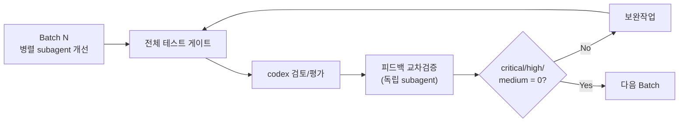

# Strategy 도메인 리팩토링 실행 계획

> ⚠️ **[2026-08-02 갱신]** 아래 buy 항목에 언급된 `_evaluate_ma5_row`(MA5 돌파 스캔)는
> 이후 MA5 전략 전체 제거와 함께 삭제되었습니다. 당시 리팩토링 이력 보존을 위해 원문 유지.

> 대상: `src/application/domain/strategy/` (19파일 / 12,363줄)
> 브랜치: `refactor/strategy-domain`
> 원칙: **동작 보존(behavior-preserving)** 우선. 임계값/정책 변경은 별도 표기 후 사용자 확인.

## ✅ 진행 상태 (완료)

| 배치 | 커밋 | 상태 |
|------|------|------|
| Batch 1 (안전+재활용) | `7233829` | ✅ 완료 (codex 검토·교차검증·hardening 반영) |
| Batch 2 Wave A (sell/notification/ohlcv 분해) | `5da044e` | ✅ 완료 (ScoreRule low 수정 포함) |
| Batch 2 Wave B (strategy_service 분해 + KRX adapter) | `efc08ba` | ✅ 완료 (@transaction 회귀 수정) |

- 전체 테스트: **517 passed, 13 skipped** (전 배치 유지)
- codex 검토 최종: critical/high/medium/**low 모두 0**
- 배포: `docker compose up -d --build` → 클린 부팅 검증(HTTP 200), 토큰 캐시 보존
- 원격: `origin/refactor/strategy-domain` 푸시 완료 (미머지 — PR 대기)

## 실행 전략 (배치 + 검증 루프)

각 배치는 **파일 소유권이 상호 배타적**인 작업 패키지(WP)로 분할 → 동일 트리에서 병렬 편집 시 충돌 없음.

---

## Batch 1 — 안전 + 재활용성/중복제거 (동작 보존)

| WP | 소유 파일(쓰기) | 핵심 작업 | 근거 findings |
|----|----------------|-----------|---------------|
| **safety** | `engine.py`(삭제), `src/main.py`, `src/CLAUDE.md` | 레거시 볼린저 이중엔진 제거(실주문 위험). 부팅 wiring/shutdown 제거 | buy#1 (High) |
| **buy** | `buy_strategy_service.py`, `golden_cross_engine.py`, `stock_screener.py` | `DEFAULT_GOLDEN_CROSS_PULLBACK`/`GOLDEN_CROSS_SCAN_STATE_ORDER` 재사용, 4× `state_order` dict 제거, `_run_scan_workers`+`_evaluate_gc_row`/`_evaluate_ma5_row` 추출로 ~500줄 중복 제거, 죽은 `_determine_gc_state` 파라미터 정리 | buy#2,3,4,5,6 |
| **sell** | `sell_strategy_service.py`, `sell_rule_research_service.py`, `sell_rule_preregistration_config.py`, `strategy_contract.py`(STAGE_ORDER 추가), `settings/sell_score_settings.py` | peak/credit 임계값 4곳 중복 → `SellScoreSettings`/`PeakRuleThresholds` 단일화(**현행 런타임 값 보존**, drift는 TODO 표기), `stage_order` 4× → 상수, `_market_credit_label` 공용화 | sell#2,5,8 |
| **sched** | `notification_scheduler.py`, `scheduler.py`, `ohlcv_data_loader.py`, `settings/config.py` | ETF맵/슬롯/임계값 → settings, `add_job` cron 4× → `_register_slot` 헬퍼, 공용 `SchedulerBase` 팩토리 | sched#3,6 |
| **crud** | `strategy_service.py` | 문자열 상태 → `GoldenCrossScanState` enum 재사용, `_get_or_raise`/`_transition_status`/`_parse_strategy_config` 헬퍼, repo DI 일관화 | crud#6,7,8,9 |

**공유 상수 소유권(충돌 방지)**: `strategy_contract.py`는 **sell WP만 쓰기**(STAGE_ORDER 추가), 나머지는 읽기 전용. `settings/config.py`는 sched WP만, `settings/sell_score_settings.py`는 sell WP만.

**Batch 1 제외(→ Batch 2)**: dto.py 재구성, ScoreRule 파이프라인, god-module 분할은 동작 위험이 커 별도 배치.

---

## Batch 2 — 구조 분해 (관심사 분리, Batch 1 zero 후)

| 영역 | 작업 | 근거 |
|------|------|------|
| sell 스코어 | `calculate_sell_score`(264줄) → 조합 가능한 `ScoreRule` 파이프라인, `available_max` mirror 제거 | sell#1 |
| sell 분석 | `analyze_sell_signal`(470줄) → load/overlay/score/format 4단 분리 | sell#3 |
| CRUD | `strategy_service.py` → `StrategyCrudService`/`UniverseService`/`AnalysisHistoryService`/`RecommendationService` facade, `refresh_universe`(470줄) 추출, KRX 스크래핑 → adapter | crud#1,2,3 |
| DTO | `dto.py`(1148줄) → `dto/` 패키지 8분할, 비-DTO 상수 이동 | crud#4,5 |
| 알림 | `notification_scheduler.py`(1204줄) → wiring/builders/dedupe + `SellAlertPresenter` | sched#2,4 |
| OHLCV | `warmup_service`/`core_loader` → `OHLCVDataLoader` 단일화 | sched#1 |

---

## 검증 게이트
- 테스트: 도메인 포커스 테스트 스위트(`tests/domain/`) 전량 통과
- codex: 각 배치 diff 검토, critical/high/medium 이슈 0까지 반복
- 교차검증: codex 피드백을 독립 subagent가 재검증(과잉/오탐 필터)

## 정책성 판단 보류 항목 (사용자 확인 필요)
- `personal_buy_ratio_high`: 설정값 `0.20` vs `evaluate_peak_rule_inputs` 코드 `0.15` — 단일화 시 어느 값이 정답인지 도메인 결정 필요. Batch 1은 **현행 런타임 값(0.15) 보존** + 명시 표기.
</content>
</invoke>
