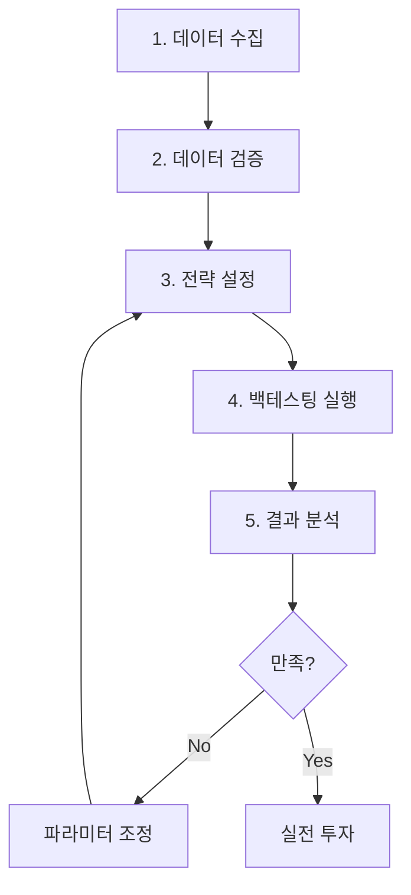
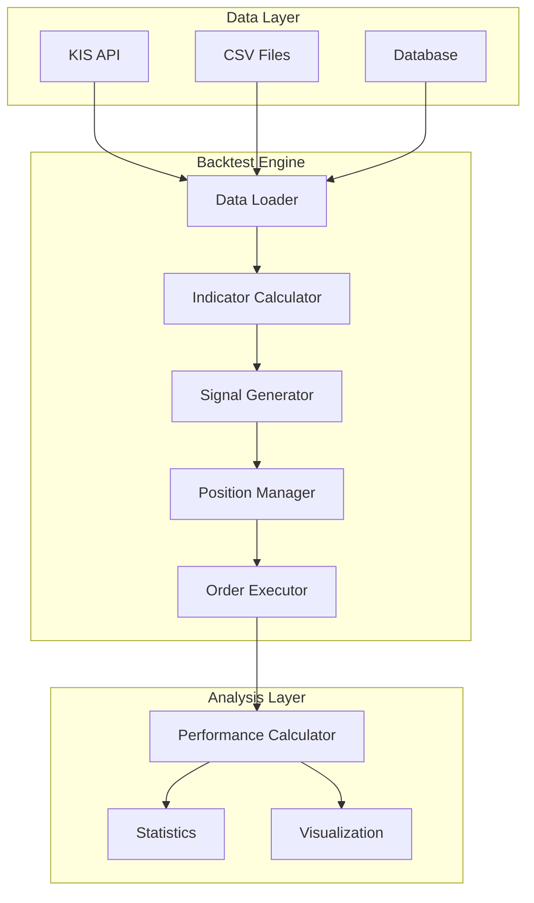

# 백테스팅 시스템 문서

## 📋 개요

이 문서는 **볼린저 밴드 + 엔벨로프 전략**의 백테스팅 시스템 구축을 위한 종합 가이드입니다.

과거 데이터를 활용하여 전략의 성과를 검증하고, 파라미터를 최적화하며, 실전 투자 전 리스크를 평가하는 체계적인 방법을 제공합니다.

## 🎯 백테스팅의 목적

### 1. 전략 검증
- 과거 데이터에서 전략이 실제로 수익을 냈는지 확인
- 다양한 시장 환경(상승장, 하락장, 횡보장)에서의 성과 평가
- 전략의 강점과 약점 파악

### 2. 파라미터 최적화
- 볼린저 밴드 기간 (10일, 20일, 30일 등)
- 표준편차 배수 (1.5, 2.0, 2.5 등)
- 엔벨로프 비율 (1%, 2%, 3% 등)
- 손절/익절 비율

### 3. 리스크 관리
- 최대 낙폭(MDD) 확인
- 변동성 측정
- 연속 손실 기간 파악
- 적정 포지션 크기 결정

### 4. 현실적인 기대치 설정
- 실제 예상 수익률
- 드로다운 대비 능력
- 평균 보유 기간
- 매매 빈도

## 📚 문서 구조

본 백테스팅 시스템은 다음 문서들로 구성되어 있습니다:

### 1. [WORK_PLAN.md](./WORK_PLAN.md)
**세부 작업 계획 및 일정**

구현할 기능들을 단계별로 나누고, 각 단계의 예상 소요 시간과 우선순위를 정의합니다.

📖 포함 내용:
- Phase별 구현 계획 (5단계)
- 각 Phase의 세부 태스크
- 예상 소요 시간
- 의존성 관계
- 마일스톤

### 2. [DATA_VALIDATION.md](./DATA_VALIDATION.md)
**데이터 수집 및 검증 방법**

백테스팅의 신뢰도는 데이터 품질에 달려있습니다. 데이터 수집, 저장, 검증 방법을 상세히 설명합니다.

📖 포함 내용:
- KIS API 차트 데이터 수집
- 데이터 저장 형식 (CSV/Database)
- 결측치 및 이상치 처리
- 주식 분할/병합 조정
- 휴장일 처리
- 데이터 품질 검증 체크리스트

### 3. [PERFORMANCE_METRICS.md](./PERFORMANCE_METRICS.md)
**성과 지표 계산 방법**

백테스팅 결과를 정량적으로 평가하기 위한 다양한 성과 지표와 계산 방법을 제시합니다.

📖 포함 내용:
- 수익 지표 (수익률, 연환산 수익률)
- 리스크 지표 (MDD, 변동성, Sharpe Ratio)
- 거래 통계 (승률, Profit Factor)
- 벤치마크 비교
- 지표별 계산식 및 Python 예제

## 🚀 빠른 시작

### 백테스팅 실행 순서



### 최소 요구사항

```python
# 백테스팅 실행을 위한 최소 데이터
백테스팅 기간: 최소 1년 (권장 3-5년)
데이터 주기: 일봉
데이터 항목: 시가, 고가, 저가, 종가, 거래량
초기 자본: 1,000만원 이상 권장
```

### 간단한 예제

```python
import asyncio
from src.application.domain.backtest.service import BacktestService
from src.application.domain.strategy.dto import StrategyConfigDTO


async def run_backtest_example():
    """백테스팅 실행 예제"""
    # 전략 설정
    config = StrategyConfigDTO(
        bollinger_band={"period": 20, "std_multiplier": 2.0},
        envelope={"period": 20, "percentage": 2.0},
        position={"allocation_ratio": 0.1},
        risk_management={
            "use_stop_loss": True,
            "stop_loss_ratio": -0.03,
            "use_take_profit": True,
            "take_profit_ratio": 0.05
        }
    )

    # 백테스팅 실행
    service = BacktestService()
    result = await service.run_backtest(
        symbol="005930",  # 삼성전자
        start_date="2023-01-01",
        end_date="2024-12-31",
        initial_capital=10_000_000,
        config=config
    )

    # 결과 출력
    print(f"총 수익률: {result.total_return:.2f}%")
    print(f"MDD: {result.mdd:.2f}%")
    print(f"승률: {result.win_rate:.2f}%")
    print(f"Sharpe Ratio: {result.sharpe_ratio:.2f}")


if __name__ == "__main__":
    asyncio.run(run_backtest_example())
```

## 📊 백테스팅 결과 해석

### 좋은 전략의 기준

| 지표 | 우수 | 양호 | 부족 |
|-----|------|------|------|
| **연환산 수익률** | > 20% | 10-20% | < 10% |
| **MDD** | < 15% | 15-25% | > 25% |
| **승률** | > 60% | 50-60% | < 50% |
| **Sharpe Ratio** | > 2.0 | 1.0-2.0 | < 1.0 |
| **Profit Factor** | > 2.0 | 1.5-2.0 | < 1.5 |

### 주의사항

⚠️ **과최적화 (Overfitting) 주의**
- 너무 많은 파라미터 조정은 과거 데이터에만 최적화될 위험
- 백테스팅 기간을 여러 구간으로 나누어 검증

⚠️ **생존 편향 (Survivorship Bias)**
- 상장폐지 종목 제외 시 수익률이 과대평가됨
- 전체 종목군 또는 상장폐지 종목 포함 필요

⚠️ **미래 정보 유출 (Look-Ahead Bias)**
- 시뮬레이션 시점에 알 수 없는 정보 사용 금지
- 예: 당일 종가를 기준으로 당일 매수 주문

⚠️ **거래 비용 고려**
- 수수료 (약 0.015% 매수/매도)
- 세금 (증권거래세 약 0.23%)
- 슬리피지 (호가 스프레드)

## 🔧 백테스팅 시스템 아키텍처



## 📖 각 문서 개요

### WORK_PLAN.md
구현 로드맵과 일정

- **Phase 1**: 데이터 수집 인프라 (2-3일)
- **Phase 2**: 백테스팅 엔진 (3-4일)
- **Phase 3**: 성과 분석 (2-3일)
- **Phase 4**: API 및 UI (2일)
- **Phase 5**: 테스트 및 검증 (2-3일)

**총 예상 기간**: 11-15일

### DATA_VALIDATION.md
데이터 품질 보장

주요 검증 항목:
- ✅ 결측치 0% 달성
- ✅ 가격 이상치 탐지
- ✅ 분할/병합 조정
- ✅ 거래량 검증
- ✅ 휴장일 처리

### PERFORMANCE_METRICS.md
정량적 평가 방법

계산 지표:
- 📈 수익률 (총, 연환산, 월별)
- 📉 리스크 (MDD, 변동성, VaR)
- 🎯 승률 & Profit Factor
- 📊 Sharpe/Sortino Ratio
- 📈 벤치마크 대비 성과

## 🎓 학습 경로

### 초급 (백테스팅 입문)
1. **WORK_PLAN.md** - 전체 흐름 파악
2. **간단한 예제 실행** - 기본 사용법 익히기
3. **PERFORMANCE_METRICS.md** - 결과 해석 방법

### 중급 (전략 최적화)
1. **DATA_VALIDATION.md** - 데이터 품질 관리
2. **파라미터 튜닝** - 그리드 서치
3. **다양한 종목 테스트** - 일반화 확인

### 고급 (시스템 구축)
1. **백테스팅 엔진 커스터마이징**
2. **자동화된 최적화 파이프라인**
3. **실시간 성과 모니터링**

## 🔗 관련 문서

- [전략 가이드](../strategy_guide.md) - 볼린저 밴드 + 엔벨로프 전략 설명
- [아키텍처 문서](../base/ARCHITECTURE.md) - 전체 시스템 구조
- [API 문서](../base/SERVICE.md) - 서비스 구현 가이드

## 💡 Best Practices

### 1. 충분한 데이터 사용
```python
# 최소 1년, 권장 3-5년
start_date = "2020-01-01"  # 5년 데이터
end_date = "2024-12-31"
```

### 2. Out-of-Sample 테스트
```python
# 70% 훈련, 30% 검증
train_period = ("2020-01-01", "2023-06-30")
test_period = ("2023-07-01", "2024-12-31")
```

### 3. 거래 비용 포함
```python
commission = 0.015 / 100  # 0.015%
tax = 0.23 / 100  # 0.23%
slippage = 0.05 / 100  # 0.05%
```

### 4. 다양한 시장 환경 테스트
- 상승장: 2020-2021
- 하락장: 2022
- 횡보장: 2023

### 5. 여러 종목 테스트
```python
symbols = [
    "005930",  # 삼성전자 (대형주)
    "000660",  # SK하이닉스 (반도체)
    "035420",  # NAVER (IT)
    "051910",  # LG화학 (화학)
]
```

## 🆘 트러블슈팅

### 문제: 백테스팅 결과가 너무 좋음
**원인**: 과최적화, 미래 정보 유출
**해결**: Out-of-sample 테스트, 코드 리뷰

### 문제: 데이터 결측치 발생
**원인**: KIS API 오류, 휴장일
**해결**: DATA_VALIDATION.md 참고

### 문제: 실전과 백테스팅 성과 차이
**원인**: 슬리피지, 수수료 미반영
**해결**: 거래 비용 정확히 반영

## 📞 문의 및 지원

백테스팅 시스템 관련 문의사항이나 개선 제안은 다음 경로로 연락 주시기 바랍니다:

- GitHub Issues: [프로젝트 이슈](https://github.com/isinthesky/envelope-stock-fastapi/issues)
- Email: 프로젝트 관리자

## 📄 라이선스

MIT License

---

**마지막 업데이트**: 2025-10-22
**문서 버전**: 1.0
