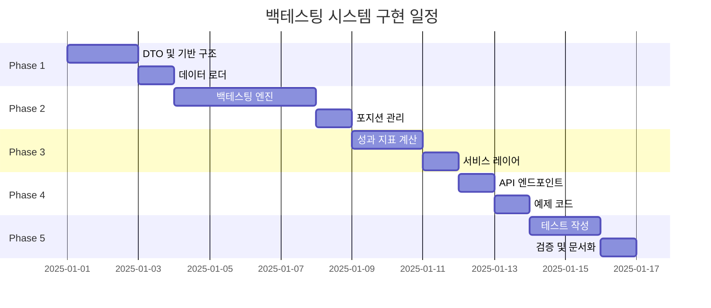

# 백테스팅 시스템 세부 작업 계획

## 📋 프로젝트 개요

**목표**: 볼린저 밴드 + 엔벨로프 전략의 백테스팅 시스템 구축
**예상 기간**: 11-15일
**난이도**: 중급

## 🎯 핵심 목표

1. **정확성**: 실전과 동일한 조건의 시뮬레이션
2. **성능**: 수년간의 데이터를 빠르게 처리
3. **확장성**: 다른 전략도 쉽게 추가 가능
4. **사용성**: 직관적인 API 및 결과 해석

## 📊 전체 로드맵



---

## 📅 Phase 1: 기반 구조 (2-3일)

### 목표
백테스팅에 필요한 기본 데이터 구조와 인프라 구축

### 세부 태스크

#### 1.1 DTO 정의 (0.5일)
**파일**: `src/application/domain/backtest/dto.py`

```python
# 구현할 DTO 목록
- BacktestRequestDTO      # 백테스팅 요청
- BacktestConfigDTO       # 백테스팅 설정
- BacktestResultDTO       # 백테스팅 결과
- TradeDTO                # 개별 거래 정보
- PositionDTO             # 포지션 정보
- DailyStatsDTO           # 일별 통계
```

**체크리스트**:
- [ ] 모든 DTO에 Pydantic 검증 추가
- [ ] 타입 힌트 정확히 설정
- [ ] Docstring 작성
- [ ] 예제 데이터 준비

**예상 시간**: 4시간

#### 1.2 데이터 로더 구현 (1일)
**파일**: `src/application/domain/backtest/data_loader.py`

```python
class BacktestDataLoader:
    """과거 차트 데이터 수집 및 전처리"""

    async def load_ohlcv_data(
        self, symbol: str, start_date: str, end_date: str
    ) -> pd.DataFrame:
        """일봉 OHLCV 데이터 로드"""
        pass

    def validate_data(self, df: pd.DataFrame) -> bool:
        """데이터 유효성 검증"""
        pass

    def preprocess_data(self, df: pd.DataFrame) -> pd.DataFrame:
        """데이터 전처리 (결측치, 이상치 등)"""
        pass
```

**기능**:
- KIS API에서 일봉 데이터 수집
- CSV 파일 읽기/쓰기
- 데이터 캐싱
- 결측치 처리
- 주식 분할 조정

**체크리스트**:
- [ ] KIS API 일봉 조회 구현
- [ ] CSV 저장/불러오기
- [ ] 결측치 보간 로직
- [ ] 날짜 정렬 및 휴장일 처리
- [ ] 유닛 테스트 작성

**예상 시간**: 8시간

#### 1.3 성과 지표 모듈 (0.5일)
**파일**: `src/application/common/performance.py`

```python
class PerformanceMetrics:
    """성과 지표 계산 유틸리티"""

    @staticmethod
    def calculate_total_return(
        initial_capital: float, final_capital: float
    ) -> float:
        """총 수익률"""
        pass

    @staticmethod
    def calculate_mdd(equity_curve: list[float]) -> float:
        """최대 낙폭 (MDD)"""
        pass

    @staticmethod
    def calculate_sharpe_ratio(
        returns: list[float], risk_free_rate: float = 0.0
    ) -> float:
        """샤프 비율"""
        pass
```

**구현 지표**:
- 총 수익률
- 연환산 수익률
- MDD
- Sharpe Ratio
- Sortino Ratio
- Profit Factor
- 승률

**체크리스트**:
- [ ] 각 지표 계산 함수 구현
- [ ] NumPy/Pandas 활용한 최적화
- [ ] 예외 처리 (0으로 나누기 등)
- [ ] Docstring with 수식
- [ ] 유닛 테스트

**예상 시간**: 4시간

### Phase 1 완료 기준
- [ ] 모든 DTO 정의 완료
- [ ] 데이터 로더 동작 확인
- [ ] 성과 지표 계산 검증
- [ ] 유닛 테스트 통과

---

## 📅 Phase 2: 백테스팅 엔진 (3-4일)

### 목표
일별 시뮬레이션을 수행하는 핵심 백테스팅 로직 구현

### 세부 태스크

#### 2.1 백테스팅 엔진 초기 구조 (0.5일)
**파일**: `src/application/domain/backtest/engine.py`

```python
class BacktestEngine:
    """백테스팅 엔진"""

    def __init__(self, config: BacktestConfigDTO):
        self.config = config
        self.positions: dict[str, Position] = {}
        self.cash = config.initial_capital
        self.equity_curve: list[float] = []
        self.trades: list[Trade] = []

    async def run(self, data: pd.DataFrame) -> BacktestResultDTO:
        """백테스팅 실행"""
        for date, row in data.iterrows():
            await self._process_day(date, row)

        return self._generate_result()
```

**체크리스트**:
- [ ] 엔진 클래스 구조 설계
- [ ] 상태 관리 (현금, 포지션, 주문)
- [ ] 일별 루프 구현

**예상 시간**: 4시간

#### 2.2 시그널 생성 로직 (1일)
**파일**: `src/application/domain/backtest/engine.py`

```python
def _generate_signals(
    self, prices: list[float], date: str
) -> str:
    """매매 시그널 생성"""
    # 기존 indicators.py 활용
    bb = TechnicalIndicators.calculate_bollinger_bands(prices)
    env = TechnicalIndicators.calculate_envelope(prices)

    signal = TechnicalIndicators.generate_combined_signal(
        current_price, bb, env
    )

    return signal  # "buy", "sell", "hold"
```

**기능**:
- 기존 `TechnicalIndicators` 클래스 재사용
- 볼린저 밴드 + 엔벨로프 계산
- 시그널 생성 (buy/sell/hold)
- 시그널 강도 계산

**체크리스트**:
- [ ] indicators.py 통합
- [ ] 시그널 생성 테스트
- [ ] 엣지 케이스 처리 (데이터 부족 등)

**예상 시간**: 8시간

#### 2.3 주문 실행 로직 (1일)
**파일**: `src/application/domain/backtest/order_manager.py`

```python
class BacktestOrderManager:
    """가상 주문 실행 관리자"""

    def execute_buy_order(
        self,
        symbol: str,
        price: float,
        quantity: int,
        date: datetime
    ) -> Trade:
        """매수 주문 실행"""
        # 1. 현금 확인
        # 2. 수수료 계산
        # 3. 포지션 생성
        # 4. Trade 기록
        pass

    def execute_sell_order(
        self,
        symbol: str,
        price: float,
        quantity: int,
        date: datetime
    ) -> Trade:
        """매도 주문 실행"""
        # 1. 포지션 확인
        # 2. 수수료 + 세금 계산
        # 3. 손익 계산
        # 4. Trade 기록
        pass
```

**기능**:
- 매수/매도 주문 실행
- 수수료 계산 (0.015%)
- 증권거래세 계산 (0.23%)
- 슬리피지 반영 (선택)

**체크리스트**:
- [ ] 매수 로직 구현
- [ ] 매도 로직 구현
- [ ] 수수료/세금 정확히 반영
- [ ] 잔고 부족 예외 처리
- [ ] 테스트 케이스 작성

**예상 시간**: 8시간

#### 2.4 포지션 관리 (1일)
**파일**: `src/application/domain/backtest/position_manager.py`

```python
class PositionManager:
    """포지션 관리"""

    def __init__(self):
        self.positions: dict[str, Position] = {}

    def open_position(
        self, symbol: str, quantity: int, entry_price: float
    ) -> None:
        """포지션 오픈"""
        pass

    def close_position(
        self, symbol: str, exit_price: float
    ) -> Trade:
        """포지션 청산"""
        pass

    def update_positions(
        self, current_prices: dict[str, float]
    ) -> float:
        """포지션 평가액 업데이트"""
        pass

    def check_stop_loss(
        self, symbol: str, current_price: float
    ) -> bool:
        """손절 체크"""
        pass

    def check_take_profit(
        self, symbol: str, current_price: float
    ) -> bool:
        """익절 체크"""
        pass
```

**기능**:
- 포지션 오픈/청산
- 평가 손익 계산
- 손절/익절 체크
- 포지션 크기 관리

**체크리스트**:
- [ ] 포지션 추가/제거
- [ ] 평가액 계산
- [ ] 손절/익절 로직
- [ ] 복수 종목 지원
- [ ] 테스트 작성

**예상 시간**: 8시간

#### 2.5 일별 처리 루프 완성 (0.5일)
**파일**: `src/application/domain/backtest/engine.py`

```python
async def _process_day(self, date: datetime, row: pd.Series) -> None:
    """일별 처리 로직"""
    # 1. 당일 가격 정보
    current_price = row['close']

    # 2. 손절/익절 체크 (장 시작 시)
    self._check_risk_management(current_price)

    # 3. 시그널 생성
    signal = self._generate_signals(self.price_history, date)

    # 4. 주문 실행
    if signal == "buy" and self.cash > 0:
        quantity = self._calculate_position_size(current_price)
        self.order_manager.execute_buy_order(...)

    elif signal == "sell" and self.has_position():
        self.order_manager.execute_sell_order(...)

    # 5. 포지션 평가액 업데이트
    self.equity_curve.append(self._calculate_equity())

    # 6. 통계 기록
    self._update_daily_stats(date, current_price)
```

**체크리스트**:
- [ ] 일별 처리 순서 정의
- [ ] 손절/익절 우선 처리
- [ ] 자본 관리
- [ ] 로깅 추가

**예상 시간**: 4시간

### Phase 2 완료 기준
- [ ] 전체 시뮬레이션 루프 동작
- [ ] 매매 기록 정확히 저장
- [ ] 손익 계산 검증
- [ ] 통합 테스트 통과

---

## 📅 Phase 3: 서비스 레이어 및 결과 분석 (2-3일)

### 목표
백테스팅 엔진을 감싸는 서비스 레이어 구축 및 결과 분석 기능

### 세부 태스크

#### 3.1 백테스팅 서비스 (1일)
**파일**: `src/application/domain/backtest/service.py`

```python
class BacktestService:
    """백테스팅 서비스"""

    def __init__(self, session: AsyncSession | None = None):
        self.session = session
        self.data_loader = BacktestDataLoader()
        self.performance = PerformanceMetrics()

    async def run_backtest(
        self,
        request: BacktestRequestDTO
    ) -> BacktestResultDTO:
        """백테스팅 실행"""
        # 1. 데이터 로드
        data = await self.data_loader.load_ohlcv_data(...)

        # 2. 엔진 초기화
        engine = BacktestEngine(request.config)

        # 3. 백테스팅 실행
        result = await engine.run(data)

        # 4. 결과 저장 (선택)
        if self.session:
            await self._save_result(result)

        return result

    async def run_multi_symbol_backtest(
        self, symbols: list[str], ...
    ) -> dict[str, BacktestResultDTO]:
        """다중 종목 백테스팅"""
        pass

    async def optimize_parameters(
        self, symbol: str, param_grid: dict
    ) -> dict:
        """파라미터 최적화 (Grid Search)"""
        pass
```

**기능**:
- 단일/다중 종목 백테스팅
- 결과 저장/조회
- 파라미터 최적화
- 벤치마크 비교

**체크리스트**:
- [ ] 서비스 레이어 구현
- [ ] 에러 핸들링
- [ ] 트랜잭션 관리
- [ ] 로깅

**예상 시간**: 8시간

#### 3.2 결과 분석 및 시각화 (1일)
**파일**: `src/application/domain/backtest/analyzer.py`

```python
class BacktestAnalyzer:
    """백테스팅 결과 분석"""

    def analyze_trades(self, trades: list[Trade]) -> dict:
        """거래 분석"""
        return {
            "total_trades": len(trades),
            "winning_trades": ...,
            "losing_trades": ...,
            "avg_win": ...,
            "avg_loss": ...,
            "max_consecutive_wins": ...,
            "max_consecutive_losses": ...,
        }

    def analyze_equity_curve(
        self, equity_curve: list[float]
    ) -> dict:
        """자본 곡선 분석"""
        return {
            "mdd": ...,
            "max_equity": ...,
            "min_equity": ...,
            "drawdown_periods": ...,
        }

    def generate_report(
        self, result: BacktestResultDTO
    ) -> str:
        """텍스트 리포트 생성"""
        pass

    def plot_equity_curve(
        self, equity_curve: list[float]
    ) -> None:
        """자본 곡선 그래프 (Matplotlib)"""
        pass
```

**기능**:
- 거래 통계 분석
- 자본 곡선 분석
- 월별/연도별 성과
- 그래프 생성 (선택)

**체크리스트**:
- [ ] 거래 분석 함수
- [ ] 자본 곡선 분석
- [ ] 텍스트 리포트
- [ ] Matplotlib 그래프 (선택)

**예상 시간**: 8시간

#### 3.3 Database 모델 (선택, 0.5일)
**파일**: `src/adapters/database/models/backtest.py`

```python
class BacktestResult(BaseModel):
    """백테스팅 결과 저장"""
    __tablename__ = "backtest_results"

    id = Column(Integer, primary_key=True)
    symbol = Column(String(20), nullable=False)
    start_date = Column(Date, nullable=False)
    end_date = Column(Date, nullable=False)
    initial_capital = Column(Numeric, nullable=False)
    final_capital = Column(Numeric, nullable=False)
    total_return = Column(Float)
    mdd = Column(Float)
    sharpe_ratio = Column(Float)
    config_json = Column(JSON)
    trades_json = Column(JSON)
    created_at = Column(DateTime, default=datetime.utcnow)
```

**체크리스트**:
- [ ] 모델 정의
- [ ] Alembic 마이그레이션
- [ ] Repository 구현

**예상 시간**: 4시간

### Phase 3 완료 기준
- [ ] 서비스 레이어 동작
- [ ] 결과 분석 기능 완성
- [ ] Database 저장 (선택)
- [ ] 리포트 생성 확인

---

## 📅 Phase 4: API 및 예제 (2일)

### 목표
사용자가 쉽게 사용할 수 있는 API 및 예제 코드 제공

### 세부 태스크

#### 4.1 REST API 엔드포인트 (1일)
**파일**: `src/application/interface/backtest_router.py`

```python
router = APIRouter(prefix="/api/v1/backtest", tags=["Backtest"])

@router.post("/run", response_model=BacktestResultDTO)
async def run_backtest(
    request: BacktestRequestDTO,
    session: AsyncSession = Depends(get_async_session)
):
    """백테스팅 실행"""
    service = BacktestService(session)
    result = await service.run_backtest(request)
    return result

@router.get("/{backtest_id}", response_model=BacktestResultDTO)
async def get_backtest_result(
    backtest_id: int,
    session: AsyncSession = Depends(get_async_session)
):
    """백테스팅 결과 조회"""
    pass

@router.get("/list", response_model=list[BacktestResultDTO])
async def list_backtest_results(
    symbol: str | None = None,
    limit: int = 100,
    session: AsyncSession = Depends(get_async_session)
):
    """백테스팅 목록"""
    pass

@router.post("/optimize")
async def optimize_parameters(
    request: OptimizeRequestDTO,
    session: AsyncSession = Depends(get_async_session)
):
    """파라미터 최적화"""
    pass
```

**체크리스트**:
- [ ] 엔드포인트 구현
- [ ] 입력 검증
- [ ] 에러 핸들링
- [ ] API 문서 (Swagger)

**예상 시간**: 8시간

#### 4.2 예제 코드 작성 (1일)
**파일**: `examples/backtest_example.py`

```python
# 예제 1: 단일 종목 백테스팅
# 예제 2: 다중 종목 백테스팅
# 예제 3: 파라미터 최적화
# 예제 4: 결과 비교 및 분석
```

**체크리스트**:
- [ ] 기본 사용 예제
- [ ] 고급 기능 예제
- [ ] 주석 및 설명
- [ ] 실행 가능한 코드

**예상 시간**: 8시간

### Phase 4 완료 기준
- [ ] API 동작 확인
- [ ] 예제 코드 실행 성공
- [ ] API 문서 완성

---

## 📅 Phase 5: 테스트 및 검증 (2-3일)

### 목표
시스템의 정확성과 안정성 검증

### 세부 태스크

#### 5.1 유닛 테스트 (1일)
**파일**: `tests/test_backtest_*.py`

```python
# 테스트 커버리지 목표: 80% 이상
- test_backtest_engine.py       # 엔진 로직
- test_performance_metrics.py   # 성과 지표
- test_order_manager.py         # 주문 실행
- test_position_manager.py      # 포지션 관리
- test_data_loader.py           # 데이터 로더
```

**체크리스트**:
- [ ] 모든 모듈 유닛 테스트
- [ ] 엣지 케이스 테스트
- [ ] 커버리지 80% 이상

**예상 시간**: 8시간

#### 5.2 통합 테스트 (0.5일)
**파일**: `tests/integration/test_backtest_integration.py`

```python
async def test_full_backtest_flow():
    """전체 백테스팅 플로우 테스트"""
    # 1. 데이터 준비
    # 2. 백테스팅 실행
    # 3. 결과 검증
    pass

async def test_multi_symbol_backtest():
    """다중 종목 백테스팅"""
    pass
```

**체크리스트**:
- [ ] End-to-End 테스트
- [ ] 실제 데이터 테스트
- [ ] 성능 테스트

**예상 시간**: 4시간

#### 5.3 실제 데이터 검증 (1일)
**목표**: 알려진 전략과 비교하여 결과 검증

```python
# 검증 방법
1. Buy & Hold 전략과 비교
2. 단순 이동평균 전략과 비교
3. 수익률, MDD 등이 합리적인 범위인지 확인
```

**체크리스트**:
- [ ] 삼성전자 3년 데이터 테스트
- [ ] Buy & Hold와 비교
- [ ] 결과 분석 및 문서화

**예상 시간**: 8시간

#### 5.4 문서화 및 마무리 (0.5일)
**파일**:
- `docs/backtesting/README.md` 업데이트
- `docs/backtesting/WORK_PLAN.md` 최종 검토
- `docs/backtesting/DATA_VALIDATION.md` 최종 검토
- `docs/backtesting/PERFORMANCE_METRICS.md` 최종 검토

**체크리스트**:
- [ ] API 문서 완성
- [ ] README에 사용 가이드 통합 (간단 예제, Best Practices, 트러블슈팅)
- [ ] 예제 코드 주석 완성
- [ ] 문서 간 일관성 검증

**예상 시간**: 4시간

### Phase 5 완료 기준
- [ ] 모든 테스트 통과
- [ ] 실제 데이터 검증 완료
- [ ] 문서 최신화

---

## 📊 마일스톤

| 마일스톤 | 완료 날짜 | 주요 산출물 |
|---------|----------|------------|
| **M1: 기반 완성** | Day 3 | DTO, 데이터 로더, 성과 지표 |
| **M2: 엔진 완성** | Day 7 | 백테스팅 엔진, 주문/포지션 관리 |
| **M3: 서비스 완성** | Day 10 | 서비스 레이어, 결과 분석 |
| **M4: API 완성** | Day 12 | REST API, 예제 코드 |
| **M5: 검증 완료** | Day 15 | 테스트, 문서, 프로덕션 준비 |

## 🎯 우선순위

### P0 (필수)
- [ ] 백테스팅 엔진 핵심 로직
- [ ] 주문 실행 (매수/매도)
- [ ] 성과 지표 계산 (수익률, MDD)
- [ ] 데이터 로더
- [ ] 기본 유닛 테스트

### P1 (중요)
- [ ] 손절/익절 로직
- [ ] 포지션 관리
- [ ] 다중 종목 지원
- [ ] REST API
- [ ] 통합 테스트

### P2 (권장)
- [ ] Database 저장
- [ ] 파라미터 최적화
- [ ] 그래프 생성
- [ ] 벤치마크 비교
- [ ] 고급 예제

### P3 (선택)
- [ ] 슬리피지 시뮬레이션
- [ ] 실시간 백테스팅
- [ ] 웹 대시보드
- [ ] 멀티프로세싱

## ⚠️ 리스크 및 대응

### 리스크 1: 데이터 품질 문제
**확률**: 높음
**영향**: 높음
**대응**:
- 데이터 검증 로직 강화
- 여러 소스 데이터 비교
- 이상치 탐지 알고리즘

### 리스크 2: 성능 이슈
**확률**: 중간
**영향**: 중간
**대응**:
- Pandas 벡터화 연산 활용
- 데이터 캐싱
- 필요 시 멀티프로세싱

### 리스크 3: 과최적화
**확률**: 중간
**영향**: 높음
**대응**:
- Out-of-sample 테스트 필수
- 단순한 전략 선호
- Walk-forward 분석

## 📈 성공 기준

### 기술적 기준
- [ ] 모든 P0, P1 기능 구현
- [ ] 테스트 커버리지 80% 이상
- [ ] 3년 데이터 1분 내 처리
- [ ] 메모리 사용량 1GB 이하

### 비즈니스 기준
- [ ] 실제 전략 성과 재현 가능
- [ ] 사용자가 30분 내 사용 가능
- [ ] 결과 해석이 명확함
- [ ] 다른 전략 추가 용이

## 📝 일일 체크리스트

매일 다음 항목을 확인:
- [ ] 오늘의 목표 달성
- [ ] 코드 커밋 및 푸시
- [ ] 테스트 작성 및 통과
- [ ] 문서 업데이트
- [ ] 코드 리뷰 (선택)

## 🔗 관련 문서

- [데이터 검증 가이드](./DATA_VALIDATION.md)
- [성과 지표 가이드](./PERFORMANCE_METRICS.md)
- [전략 가이드](../strategy_guide.md)

---

## 📋 문서 검토 및 수정 이력

### 2025-10-22 - 초안 작성 및 검토 반영

#### 초안 작성
- ✅ README.md: 백테스팅 시스템 개요 및 빠른 시작 가이드
- ✅ WORK_PLAN.md: 5단계 구현 계획 (11-15일 예상)
- ✅ DATA_VALIDATION.md: 데이터 수집 및 검증 방법론
- ✅ PERFORMANCE_METRICS.md: 성과 지표 계산 가이드

#### 검토 및 수정 사항

**1. README.md - 비동기 실행 패턴 수정**
- **문제**: 최상위 레벨에서 `await` 사용 불가
- **수정**: `asyncio.run()` 래퍼로 감싼 실행 가능한 예제로 변경
- **위치**: 103-143 라인

**2. DATA_VALIDATION.md - 함수 시그니처 보완**
- **문제**: `collect_with_rate_limit`, `collect_long_period` 함수가 `service` 인자 누락
- **수정**: `service: MarketDataService` 인자 추가
- **위치**: 97-128 라인, 138-178 라인
- **영향**: NameError 방지, 실제 사용 가능한 코드로 개선

**3. PERFORMANCE_METRICS.md - 단위 일관성 보장**
- **문제**: `benchmark_return` 계산 시 0.1 형태(10%)를 % 단위 기대 함수에 전달
- **수정**: `benchmark_return *= 100`으로 % 단위 변환 추가
- **위치**: 1021-1022 라인
- **영향**: Alpha, Information Ratio 계산 오류 방지

**4. WORK_PLAN.md - 문서 구조 현실화**
- **문제**: `USAGE_GUIDE.md` 파일 생성 계획이 있었으나 README에 통합됨
- **수정**: Phase 5.4 체크리스트를 실제 생성된 문서 구조에 맞게 조정
- **위치**: 689-700 라인
- **변경**:
  - `USAGE_GUIDE.md 추가` → `WORK_PLAN.md 최종 검토` 등으로 변경
  - "사용 가이드 작성" → "README에 사용 가이드 통합" 명시

**5. PERFORMANCE_METRICS.md - 유지보수 가이드 추가**
- **문제**: 함수 중복 정의 우려 및 향후 유지보수 리스크
- **수정**: `PerformanceAnalyzer` 클래스에 실제 구현 시 권장사항 추가
- **위치**: 958-975 라인
- **내용**:
  - 모든 계산 함수를 별도 유틸리티 모듈로 분리 권장
  - 예시 디렉토리 구조 제시
  - 함수 재사용 명시로 일관성 보장

#### 검토 결과 요약

| 항목 | 상태 | 비고 |
|------|------|------|
| 실행 가능성 | ✅ 개선 | 모든 코드 예제가 실행 가능 |
| 타입 일관성 | ✅ 개선 | 단위 변환 명시 |
| 문서 완결성 | ✅ 개선 | 계획과 실제 산출물 일치 |
| 유지보수성 | ✅ 개선 | 권장 구조 가이드 추가 |

---

**최종 업데이트**: 2025-10-22
**문서 버전**: 1.1 (검토 반영)
**작성자**: 백테스팅 팀
