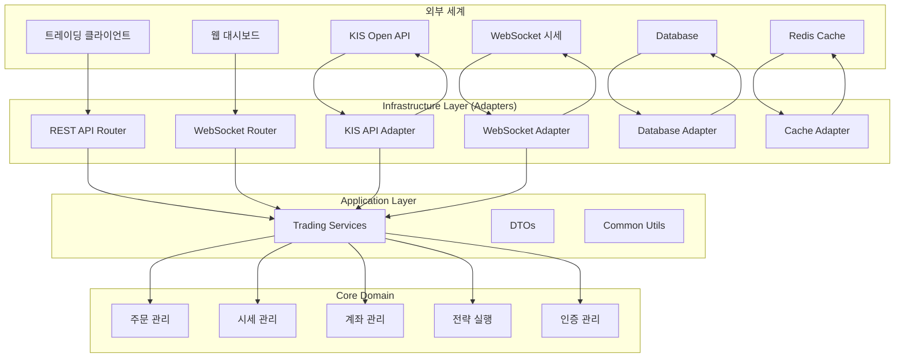

# 증권 자동매매 API 서버 아키텍처 - KIS Trading API Service

## 📋 개요

이 문서는 **한국투자증권 Open API 기반 자동매매 서비스(KIS Trading API)**의 서버 구조와 구현 규칙을 정의합니다. **헥사고날 아키텍처(Hexagonal Architecture)**를 기반으로 설계된 증권 자동매매 시스템의 계층별 역할과 데이터 흐름을 설명합니다.

### 🎯 시스템 특징

- **다중 상품 지원**: 국내/해외 주식, 선물옵션, 채권, ETF/ETN, ELW 등 전방위 금융상품 거래
- **실전/모의투자 환경**: 완벽히 분리된 실전투자/모의투자 환경 지원
- **실시간 시세**: WebSocket 기반 실시간 호가/체결 정보 제공
- **자동매매 전략**: 조건 기반 자동 주문 실행 시스템
- **안전한 인증**: OAuth2 기반 토큰 관리 및 자동 갱신
- **REST + WebSocket**: 양방향 통신으로 실시간성과 안정성 확보

---

## 🏛️ 아키텍처 개요

### 헥사고날 아키텍처 (Ports & Adapters Pattern)



---

## 📁 폴더 구조 및 역할

### 전체 구조 (계획)

```text
src/
├── adapters/           # 외부 시스템 연동 계층
│   ├── database/       # DB 연동 어댑터
│   ├── external/       # 외부 API 연동 어댑터
│   │   ├── kis_api/    # KIS Open API 클라이언트
│   │   └── websocket/  # WebSocket 연결 관리
│   └── cache/          # Redis 캐시 어댑터
├── application/        # 애플리케이션 계층
│   ├── common/         # 공통 유틸리티
│   ├── domain/         # 도메인별 서비스 + Repository
│   └── interface/      # 인터페이스 계층
└── settings/           # 설정 및 환경 구성
```

### 현재 구조 (샘플 코드 기반)

```text
open-trading-api/
├── docs/                    # 프로젝트 문서
│   ├── ARCHITECTURE.md      # 아키텍처 문서 (본 문서)
│   ├── SERVICE.md           # 서비스 구현 가이드
│   └── convention.md        # 코딩 컨벤션
├── examples_llm/            # LLM용 기능 단위 샘플
│   ├── kis_auth.py          # 인증 공통 함수
│   ├── domestic_stock/      # 국내주식 (74개 API)
│   ├── overseas_stock/      # 해외주식 (34개 API)
│   ├── etfetn/             # ETF/ETN (2개 API)
├── examples_user/           # 사용자용 통합 예제
│   ├── kis_auth.py          # 인증 공통 함수
│   └── [카테고리]/
│       ├── [카테고리]_functions.py     # REST API 통합 함수
│       ├── [카테고리]_examples.py      # REST API 사용 예제
│       ├── [카테고리]_functions_ws.py  # WebSocket 통합 함수
│       └── [카테고리]_examples_ws.py   # WebSocket 사용 예제
├── MCP/                     # MCP 서버 (Claude Desktop 연동)
├── stock_info/             # 종목 정보 파일
├── kis_devlp.yaml          # API 설정 파일
└── pyproject.toml          # 프로젝트 의존성
```

### 1. Adapters Layer (어댑터 계층)

| 구분 | 역할 | 주요 파일 |
|------|------|----------|
| **KIS API** | 한국투자증권 Open API 연동 | `kis_auth.py`, `kis_api_client.py` |
| **WebSocket** | 실시간 시세 수신 | `kis_websocket.py`, `market_data_handler.py` |
| **Database** | ORM 모델 및 DB 마이그레이션 | `models/order.py`, `models/account.py` |
| **Cache** | Redis 기반 시세/계좌 캐싱 | `redis_client.py`, `cache_manager.py` |

**핵심 모델:** Order(주문), Account(계좌), Position(포지션), MarketData(시세), Strategy(전략)

### 2. Application Layer (애플리케이션 계층)

#### 도메인별 구성

| 도메인 | 역할 | 주요 기능 |
|--------|------|----------|
| **Auth** | 인증 관리 | 토큰 발급/갱신, 실전/모의 환경 전환 |
| **Order** | 주문 처리 | 매수/매도 주문, 정정/취소, 체결 추적 |
| **Account** | 계좌 관리 | 잔고 조회, 포지션 관리, 손익 분석 |
| **MarketData** | 시세 관리 | 현재가, 호가, 차트 데이터 조회 |
| **Strategy** | 전략 실행 | 조건 검증, 자동 주문 실행, 리스크 관리 |
| **WebSocket** | 실시간 데이터 | 실시간 호가/체결, 이벤트 핸들링 |

각 도메인은 **Service**, **Repository**, **DTO** 3계층 구조로 구성

---

## 🔧 핵심 구현 패턴

### 1. BaseRepository + Mixin 패턴
- **효과**: 공통 CRUD 로직 재사용으로 40% 코드 감소
- **구성**: `BaseRepository[Model]` + `SearchableMixin` + `TimestampMixin` + `StatsMixin`
- **이점**: 도메인별 특화 메서드만 추가 구현

### 2. 의존성 주입 중앙화 (dependencies.py)
- **@lru_cache**: Singleton 패턴으로 성능 최적화
- **Annotated 타입**: 컴파일 타임 타입 검증
- **100% 일관성**: 모든 Router가 동일한 패턴 사용

### 3. @transaction 데코레이터 패턴
- **선언적 트랜잭션**: Service Layer에서 자동 session 관리
- **적용 원칙**: 외부 호출 메서드만 데코레이션, 내부 헬퍼는 제외
- **Router 단순화**: Session 의존성 제거로 Router Layer 간소화

### 4. KIS API Client 관심사 분리
- **인증 계층**: Token 발급/갱신 자동화
- **API 계층**: REST 호출 추상화
- **WebSocket 계층**: 실시간 데이터 수신
- **에러 처리**: API 에러코드 매핑 및 재시도 로직

### 5. 실시간 시세 관리 시스템 (WebSocket)

#### WebSocket 구조

**핵심 역할:** 실시간 시세 데이터 수신 및 이벤트 처리

| 기능 | 설명 |
|------|------|
| **연결 관리** | WebSocket 연결 생성, 유지, 재연결 |
| **구독 관리** | 종목별 실시간 호가/체결 구독 |
| **데이터 파싱** | 수신 데이터 파싱 및 정규화 |
| **이벤트 발행** | 시세 변동 이벤트 발행 |

#### 실시간 데이터 처리 패턴

**데이터 플로우:** `WebSocket 수신` → `데이터 파싱` → `이벤트 발행` → `전략 트리거`

---

## 🔄 주요 API Flow

### 주요 플로우

| 시나리오 | 핵심 단계 | 관련 API |
|----------|----------|----------|
| **자동매매 실행** | 전략 조건 확인 → 시세 조회 → 주문 실행 → 체결 확인 | `/strategies/execute`, `/orders/create` |
| **실시간 모니터링** | WebSocket 연결 → 시세 구독 → 이벤트 수신 → 대시보드 업데이트 | `/ws/connect`, `/ws/subscribe` |
| **계좌 관리** | 인증 → 잔고 조회 → 포지션 분석 → 손익 계산 | `/auth/token`, `/accounts/balance`, `/positions` |

---

## 🎯 주요 API 엔드포인트 (계획)

| 도메인 | API | 메서드 | 설명 |
|--------|-----|--------|------|
| **Auth** | `/auth/token` | POST | 접근 토큰 발급 |
|  | `/auth/refresh` | POST | 토큰 갱신 |
|  | `/auth/environment` | PUT | 실전/모의 환경 전환 |
| **Order** | `/orders` | POST | 주문 생성 (매수/매도) |
|  | `/orders/{id}/modify` | PUT | 주문 정정 |
|  | `/orders/{id}/cancel` | DELETE | 주문 취소 |
|  | `/orders/{id}/status` | GET | 체결 상태 조회 |
| **Account** | `/accounts/balance` | GET | 계좌 잔고 조회 |
|  | `/accounts/positions` | GET | 보유 포지션 조회 |
|  | `/accounts/pnl` | GET | 손익 분석 |
| **MarketData** | `/market/price/{symbol}` | GET | 현재가 조회 |
|  | `/market/orderbook/{symbol}` | GET | 호가 조회 |
|  | `/market/chart/{symbol}` | GET | 차트 데이터 조회 |
| **Strategy** | `/strategies` | POST | 자동매매 전략 생성 |
|  | `/strategies/{id}/execute` | POST | 전략 실행 |
|  | `/strategies/{id}/status` | GET | 전략 상태 조회 |
| **WebSocket** | `/ws/connect` | WebSocket | 실시간 연결 |
|  | `/ws/subscribe` | WebSocket | 종목 구독 |

---

## 🔒 보안 및 최적화

### 보안 처리
- **OAuth2 토큰**: 접근 토큰 자동 갱신 (24시간 유효)
- **환경 분리**: 실전투자/모의투자 완전 분리
- **API 키 암호화**: 환경 변수 및 암호화된 설정 파일 사용
- **Rate Limiting**: API 호출 제한 (분당 20회)
- **WebSocket 인증**: 연결 시 approval_key 검증

### 성능 최적화
- **DB 인덱스**: (symbol, timestamp), (account_id, order_status)
- **Redis 캐싱**:
  - 시세 데이터 (5초 TTL)
  - 계좌 정보 (30초 TTL)
  - 토큰 정보 (24시간 TTL)
- **Connection Pool**:
  - HTTP 연결 재사용 (keep-alive)
  - WebSocket 연결 풀링
- **비동기 처리**: asyncio 기반 동시 요청 처리

### 자동매매 특화 규칙
- **실시간 응답**: WebSocket 기반 < 100ms 체결 알림
- **동시성 제어**: 주문 중복 방지 (Idempotency Key)
- **에러 복구**: 네트워크 장애 시 자동 재연결 및 재시도
- **리스크 관리**: 일일 손실 제한, 최대 보유 종목 수 제한

---

## 📊 지원 금융상품 및 API 현황

### 금융상품별 API 수

| 카테고리 | API 수 | REST | WebSocket | 주요 기능 |
|---------|--------|------|-----------|----------|
| **국내주식** | 74개 | 52개 | 22개 | 현재가, 호가, 차트, 잔고, 주문, 순위분석 |
| **해외주식** | 34개 | 28개 | 6개 | 미국/아시아 시세, 주문, 체결, 권리종합 |
| **국내선물옵션** | 20개 | 14개 | 6개 | 선물옵션 시세, 호가, 주문, 야간거래 |
| **해외선물옵션** | 19개 | 17개 | 2개 | 해외선물 시세, 주문, 증거금, 옵션호가 |
| **국내채권** | 14개 | 12개 | 2개 | 채권 시세, 호가, 발행정보, 주문체결 |
| **ETF/ETN** | 2개 | 2개 | 0개 | NAV 비교추이, 현재가 |
| **ELW** | 1개 | 1개 | 0개 | 거래량순위 |

**총 166개 API 지원** (REST: 126개, WebSocket: 40개)

---

## 📚 관련 문서

- [서비스 구현 가이드](/docs/SERVICE.md)
- [코딩 컨벤션](/docs/convention.md)
- [한국투자증권 Open API 포털](https://apiportal.koreainvestment.com/)
- [프로젝트 README](/README.md)

---

## 📞 문의 및 지원

이 구현 규칙에 대한 문의사항이나 개선 제안이 있으시면 다음으로 연락해주세요:

- **프로젝트**: KIS Trading API Server
- **문서 위치**: `/docs/ARCHITECTURE.md`
- **최종 업데이트**: 2025년 10월 6일
- **문서 버전**: 1.0 (초기 설계)

---

**💡 중요**: 이 서비스는 한국투자증권 Open API를 기반으로 설계되었으며, **헥사고날 아키텍처**를 통해 외부 시스템과의 결합도를 최소화하고 테스트 가능성을 극대화합니다. 현대적 아키텍처 패턴과 금융 도메인 특화 설계로 안전하고 효율적인 자동매매 시스템을 구현합니다.
