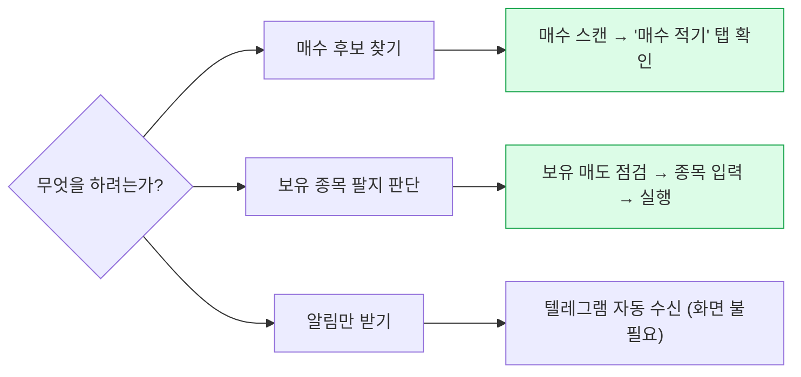
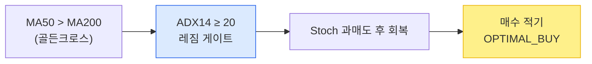

# 매수/매도 전략 사용 가이드 (mypage 기준)

> 대상: 운영자 · 최종 갱신 2026-08-02 · 기준 브랜치 `main`
> 이 문서는 **현행 코드 실측 기반**입니다. 계획/과거 문서는 `docs/archive/` 참고.

---

## 0. 핵심 요약 — 먼저 이것만

- **라이브 매수 전략은 골든크로스 하나뿐입니다.** 고를 것이 없습니다. (MA5 돌파·MA 변형은 제거됨)
- **매도는 점수 기반 4단계**로 자동 산출됩니다.
- **매수 스캔·매도 알림은 스케줄러가 자동 실행**합니다. mypage 화면은 대부분 *검토·수동 확인용*입니다.
- ⚠️ **실주문으로 이어지는 유일한 조작은 `내 전략` 화면의 프리셋 활성화**뿐입니다. 나머지 버튼은 주문을 내지 않습니다.



---

## 1. 하루 자동 실행 타임라인 (평일 KST)

| 시각 | 주체 | 동작 |
|------|------|------|
| 08:00 | StrategyScheduler | 유니버스 갱신 |
| 09:20 → 09:30 | NotificationScheduler | 매도 리스크 갱신 → 매도 알림 |
| 11:30 / 14:30 | NotificationScheduler | 매수 스캔 → 매수 알림 |
| 12:20 → 12:30 | NotificationScheduler | 매도 리스크 갱신 → 매도 알림 |
| **15:35** | StrategyScheduler | **활성 골든크로스 전략 실주문 실행 (`dry_run=False`)** |

> ⚠️ 15:35 실주문은 `strategies` 테이블에 **활성 전략이 있을 때만** 발생합니다. 현재는 활성 전략이 없어 안전하지만 **kill-switch가 없습니다.**

---

## 2. mypage 화면 지도

```
운영    Dashboard · Operations · Access Logs
전략    전략 센터 · Sell Strategy · 보유 매도 점검 · Backtest · 전략 연구
데이터  OHLCV Cache · WebSocket
수동/고급(자동화로 대체됨)  Auth · Account · Order · Market Data
```

| 화면 | URL | 용도 | 실주문? |
|------|-----|------|:-------:|
| 전략 센터 | `/mypage/strategy-hub` | 매수 스캔·추천·내전략 3탭 허브 | — |
| └ 매수 스캔 | `/mypage/strategy` | 골든크로스 스캔·재무필터 | ✕ |
| └ 추천/룰셋 | `/mypage/recommendation` | 후보 추천·walk-forward | ✕ |
| └ 내 전략 | `/mypage/strategy/dashboard` | 프리셋 **활성화** | ⚠️ **O** |
| Sell Strategy | `/mypage/sell-strategy` | 매도 시그널·현금화 계획 | ✕ |
| 보유 매도 점검 | `/mypage/holdings` | 보유종목 매도 판단 | ✕ |
| Backtest | `/mypage/backtest` | 백테스트 검증 | ✕ |

---

## 3. 매수(BUY) — 골든크로스

### 3.1 전략 로직



- **핵심 조건**: `MA50 > MA200` 활성 + Stochastic 풀백 후 회복
- **진입 레짐 게이트 (ON)**: `ADX14 ≥ 20` — 추세 강도가 있는 국면에서만 진입(횡보장 잠식 회피). 벤치 `069500`(KODEX200) 실 OHLC 사용
- **부속 옵션**: RSI 과매도 게이트(≤40, 기본 OFF) · Fear-buy 공포윈도우(기본 ON)
- **상태 6단계**: `OPTIMAL_BUY > BUY_INTEREST > READY_TO_BUY > WAITING_FOR_PULLBACK > GC_ACTIVE > NOT_GC`

### 3.2 매수 스캔 사용법 (`/mypage/strategy`)

버튼을 **위→아래 순서**로 누르면 됩니다:

1. `유니버스 갱신` — (보통 08:00 자동, 수동 불필요)
2. `골든크로스 스캔` — 후보 산출
3. `재무 필터 (2차)` — DART 재무로 걸러내기 (ETF 모드면 생략)
4. 결과 탭에서 **`매수 적기(OPTIMAL_BUY)`** 확인 ← **가장 강한 후보**

→ 여기까지 전부 **읽기 전용**. 실주문 안 나감.

### 3.3 관련 엔드포인트

```
GET  /api/v1/strategies/universe/golden-cross-scan
GET  /api/v1/strategies/universe/golden-cross-recommendations
POST /api/v1/strategies/universe/golden-cross-recommendations/notify   # + 텔레그램
POST /api/v1/strategies/universe/golden-cross-scan-symbols             # 지정 심볼
POST /api/v1/strategies/universe/financial-filter
```

---

## 4. 매도(SELL) — 점수 기반 4단계

### 4.1 점수 규칙과 단계

12개 규칙 점수를 합산 → 100점 정규화 → 단계 판정:

| 정규화 점수 | 단계 | 청산 비율 |
|:-----------:|------|:---------:|
| **≥ 70** | EXIT_ALL | 전량 (100%) |
| **≥ 50** | REDUCE_2 | 30~40% |
| **≥ 30** | REDUCE_1 | 20~30% |
| < 30 | HOLD | — |

주요 규칙(가중치): Stoch 30 · RSI 25 · Volume 20 · ADX 15 · 개인수급 12 · MA 10 · 데드크로스 10 · 신용 8 · risk_combo 6 · ADX강세 페널티(감점)

### 4.2 매도 판단 사용법

| 목적 | 화면 → 조작 |
|------|-------------|
| **내 보유 전체 점검** | `보유 매도 점검` → 종목 입력 → `매도 점검 실행` → REDUCE/EXIT만 대응 |
| 개별 종목 판단 | `Sell Strategy` → 종목코드 → `매도 시그널 분석` |
| 목표 현금비중 청산계획 | `Sell Strategy` → `현금화 계획 갱신` (`target_cash_ratio`) |

### 4.3 관련 엔드포인트

```
GET /api/v1/strategies/sell-signal/{symbol}
GET /api/v1/strategies/portfolio-cash-plan?target_cash_ratio=0.30
```

---

## 5. 실전 루틴 (이대로만)

1. **매수 후보** → `매수 스캔`의 "매수 적기" 탭 확인 → 관심종목 메모
2. **매도 판단** → `보유 매도 점검`에 보유종목 입력 → 실행 → REDUCE/EXIT 대응
3. **알림** → 텔레그램 자동 수신(매수 11:30·14:30 / 매도 09:30·12:30) — 화면 안 켜도 됨

---

## 6. ⚠️ 반드시 지킬 것

1. **`내 전략` 프리셋 활성화 금지** — 검증되지 않은 전략에 15:35 실주문이 나갑니다.
2. **골든크로스는 실측상 여전히 NO-GO** — walk-forward(98종목·8fold) OOS Sharpe 음수. ADX 게이트로 횡보 잠식만 줄인 상태이며 **실자산 엣지가 확인된 것이 아닙니다.** → **paper-trade 검증 단계로 취급.**
3. **ADX 게이트는 벤치 데이터에 의존** — `069500` 일봉 백필이 7일 넘게 밀리면 조용히 fail-open(게이트 무효화)됩니다. 데이터 신선도 = 필터 작동 여부.

### 근거 문서
- 백테스트 결과: `docs/backtesting/PERFORMANCE_TEST_RESULTS.md`, `reports/walk_forward_*`
- 레짐 A/B: `reports/walk_forward_regime_ab_20260802_*`
- 완료된 계획 이력: `docs/archive/`
